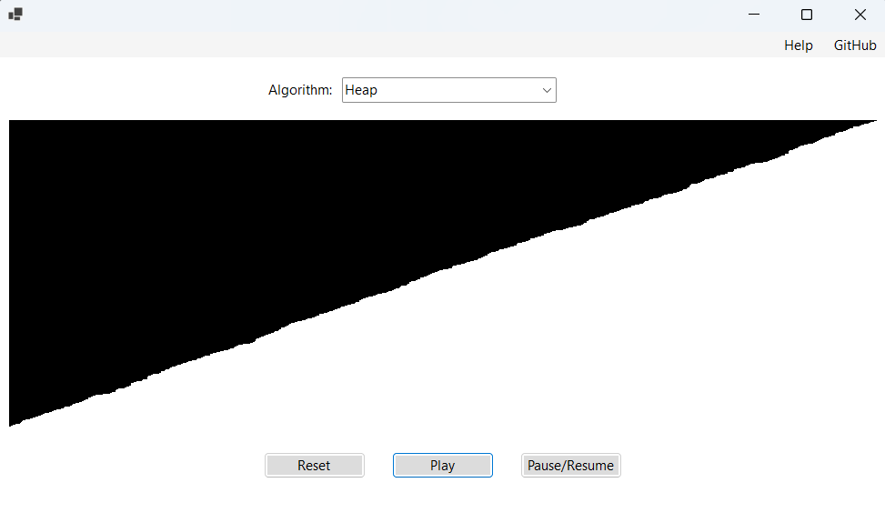

# Sort-Visualizer

A sorting algorithm visualizer used to used to visually represent the time-complexity and logic behind several unique sorting algorithms.



## Instructions
Select an algorithm of your choice using the drop-down list located on the top-middle of the form and run by clicking "Play".
To pause or resume an algorithm click the "Pause/Resume" button.
To reset the panel you must wait for the algorithm to finish running, or pausing the algorithm.

## Prerequisites
Install .NET using Visual Studio: [.NET 8.0](https://learn.microsoft.com/en-us/dotnet/core/install/windows#net-installer)

If installing through PowerShell:
```sh
dotnet-install.ps1 -Runtime windowsdesktop
dotnet-install.ps1 -Runtime aspnetcore
dotnet-install.ps1
```
